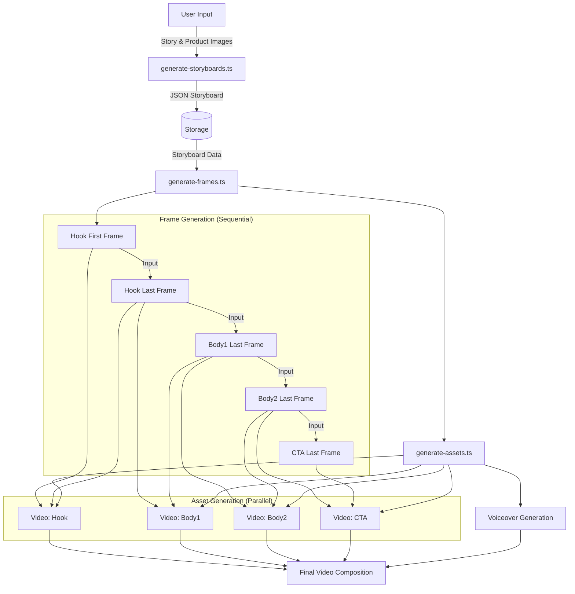

# AdUbun Image & Video Generation Process

## 1. High-Level Overview

The AdUbun generation pipeline transforms a user's product story into a complete video ad through a multi-stage process:
1.  **Story Generation**: User input is converted into a structured story (Hook, Body, CTA).
2.  **Storyboard Generation**: The story is broken down into visual scenes with specific prompts.
3.  **Frame Generation**: Static keyframe images are generated for each scene to ensure visual consistency.
4.  **Asset Generation**: Video clips are generated from these frames, and voiceovers are synthesized.
5.  **Composition**: (Frontend/Editor) Clips are assembled into the final video.

**Key Technologies:**
-   **Story/TTS**: OpenAI (GPT-4o, TTS-1)
-   **Image Generation**: Replicate / Google Nano-banana Pro (for fast, consistent frames)
-   **Video Generation**: Replicate / Google Veo (Veo-3.1 or Veo-3-Fast)

---

## 2. Detailed Component Breakdown

### A. Storyboard Generation
-   **File**: `server/api/generate-storyboards.post.ts`
-   **Input**: Story description, product images, mood/tone.
-   **Process**:
    -   Uses OpenAI `gpt-4o` to generate a JSON structure with 4 segments: Hook, Body1, Body2, CTA.
    -   **Character Consistency**: Extracts character descriptions from the Hook scene and enforces strict consistency instructions (e.g., "same [age] [gender] person with [features]") across all subsequent segments in the `visualPrompt`.
-   **Output**: A `Storyboard` object saved to storage.

### B. Frame Generation (Keyframe Images)
-   **File**: `server/api/generate-frames.post.ts`
-   **Goal**: Generate 5 specific reference images to guide the video generation.
-   **The 5 Frames**:
    1.  **Hook First Frame**: Start of the video.
    2.  **Hook Last Frame**: Transition point to Body1.
    3.  **Body1 Last Frame**: Transition point to Body2.
    4.  **Body2 Last Frame**: Transition point to CTA.
    5.  **CTA Last Frame**: End of the video.
-   **Sequential Logic (The "Daisy Chain")**:
    -   To ensure smooth transitions and visual consistency, frames are generated sequentially.
    -   Frame $N$ uses Frame $N-1$ as an image input (except the very first frame).
    -   **Transitions**: For "Last Frames" (Hook Last, Body1 Last, Body2 Last), the prompt enforces "CRITICAL VISUAL CONTINUITY" to keep composition similar to the previous frame.
    -   **Scene Progression**: For the CTA frame, the logic changes to "SCENE PROGRESSION," forcing a different angle or composition while keeping the same characters/setting.
-   **Model**: Google `nano-banana-pro` (via Replicate) is used for high-speed image generation.

### C. Video & Audio Generation (Assets)
-   **File**: `server/api/generate-assets.post.ts`
-   **Process**:
    -   **Parallel Execution**: In production mode, all 4 video segments (Hook, Body1, Body2, CTA) are generated simultaneously.
    -   **Video Generation**:
        -   Uses **Google Veo** (via Replicate).
        -   **Inputs**:
            -   `image`: The **First Frame** of the segment (anchors the start).
            -   `last_frame`: The **Last Frame** of the segment (anchors the end).
            -   `prompt`: The visual prompt for the scene.
        -   This "interpolation" between a fixed start and end frame ensures the video connects perfectly with the preceding and following scenes.
    -   **Voiceover**:
        -   Extracts spoken text from `audioNotes`.
        -   Uses OpenAI `tts-1` (Alloy voice) to generate MP3s.
-   **Output**: Video URLs (uploaded to S3) and Audio URLs.

### D. Frontend Orchestration
-   **File**: `app/pages/storyboards.vue` & `app/composables/useGeneration.ts`
-   **Role**:
    -   Allows the user to review and edit the storyboard/prompts before generation.
    -   Triggers the frame generation (manual step).
    -   Triggers the final asset generation.
    -   Polls `generate-assets` status to update the UI with progress.

---

## 3. Data Flow Summary

